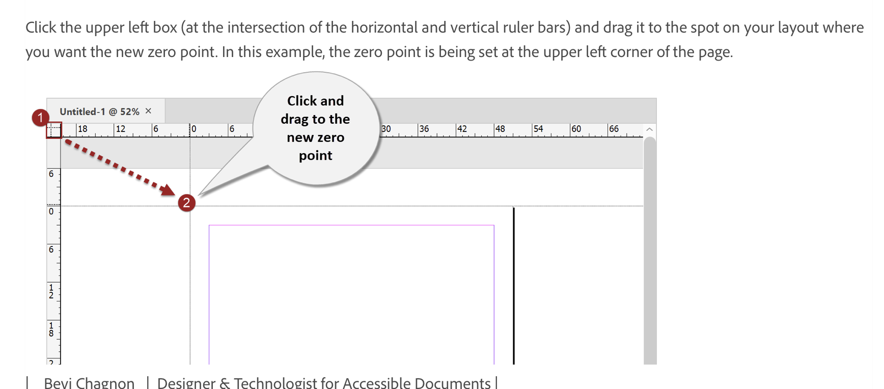
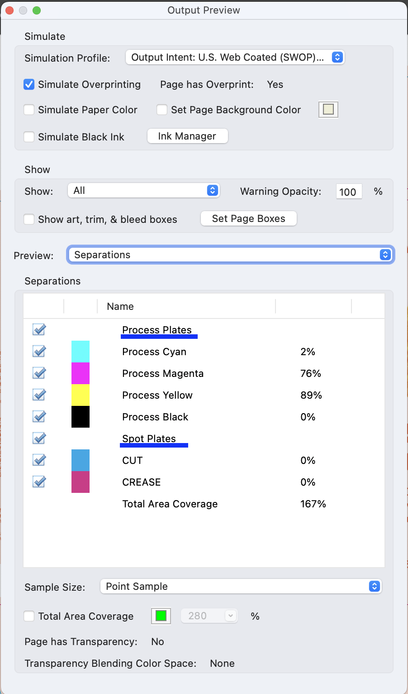
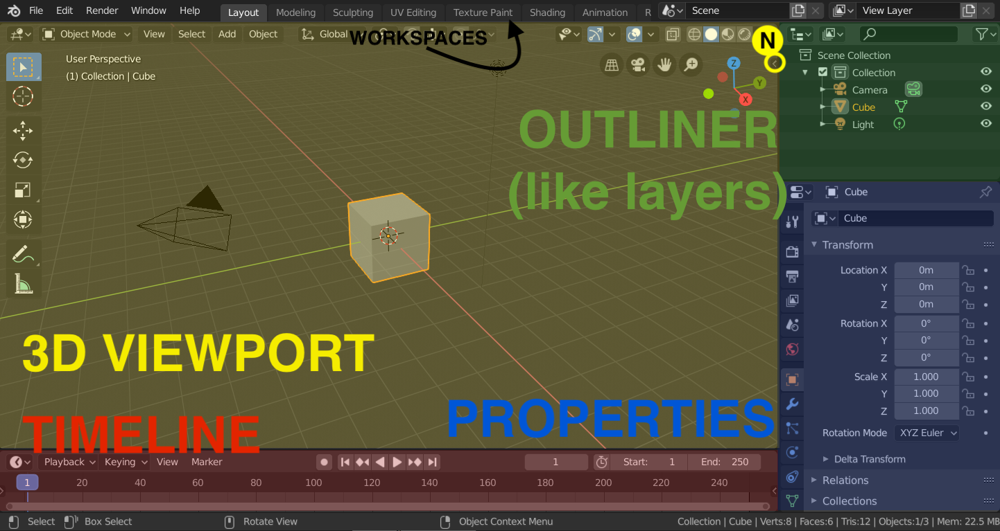
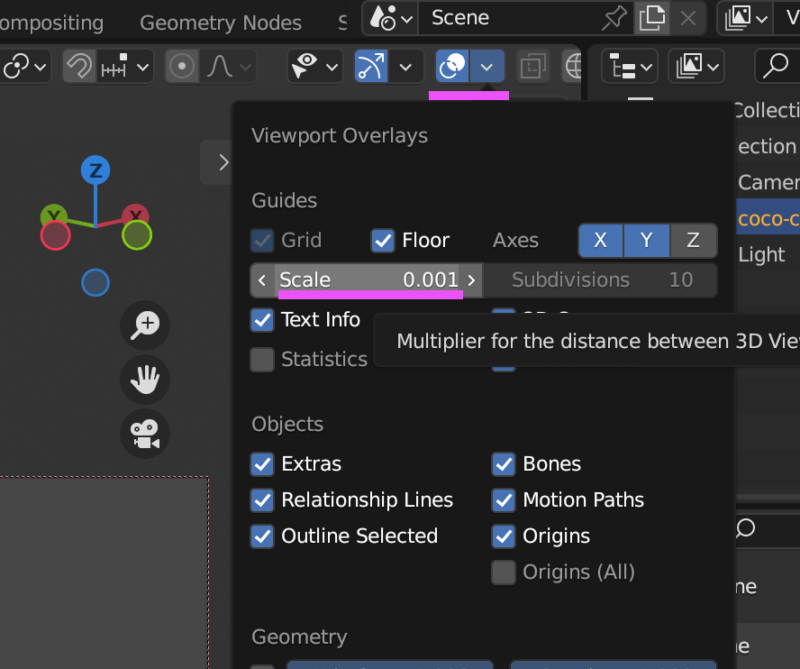
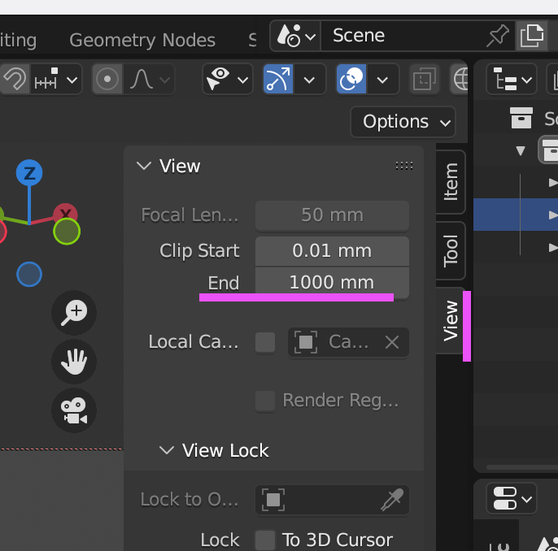

## Resources
### Evergreens
🔗 [Wada Sanzo Colour Dictionary](https://www.wada-sanzo-colors.com/combinations/classic/all)

🔗 [Google Material Design Icons](https://fonts.google.com/icons?icon.size=24&icon.color=%235f6368&icon.style=Rounded)

🔗 [HTML to SVG](https://editsvgcode.com/)

==Assets== [Mr. Mockup](https://mrmockup.com/) • [Pacdora](https://www.pacdora.com/)

### Inspo
==General== [DIELINE](https://thedieline.com/) • [It’s Nice That](https://www.itsnicethat.com/) • [Packaging of the World](https://packagingoftheworld.com/)

==Textbook== [Fraus](https://ucebnice.fraus.cz/catalog/cs/p9940.html) • [Baobab](https://www.baobab-books.net/) • [Meander](https://www.meander.cz/) • [Raketa](https://www.raketa-casopis.cz/) • [Vividbooks](https://eshop.vividbooks.com/) • [Nakladatelství UMPRUM](https://www.umprum.cz/cs/web/pro-verejnost/nakladatelstvi/vydane-tituly) • [Nakladatelství AVU](https://avu.cz/ostatni/publikace) • [Host Brno](https://www.hostbrno.cz/) • [Page Five](https://www.pagefive.com/) • [Nejkrásnější české knihy roku](https://www.muzeumliteratury.cz/nejkrasnejsi-ceske-knihy-roku) • [Spector Books](https://spectorbooks.com/catalogue/) • [Verso](https://www.versobooks.com/collections/catalog) • []()

==Supplements== [Performance Lab](https://eu.performancelab.com/collections/energy) • [Gainful](https://www.gainful.com/) • [Ritual](https://ritual.com/) • [LMNT](https://drinklmnt.com/?variant=16358367199266) • [AG1](https://drinkag1.com/en-eu) • [Czech Virus](https://czechvirus.cz/) • [Reflex](https://www.reflexnutrition.cz/) • [TB12](https://tb12sports.com/) • [Klean](https://www.kleanathlete.com/) • [Thorne](https://www.thorne.com/) • [Ladder](https://ladder.sport/) • [GNC](https://www.gnc.com/) • [Clearly](https://clearly.eu/)

==Cosmetics== [The Ordinary](https://theordinary.com/en-de) • [Clinique](https://www.clinique.com/) • [Wyn Beauty](https://www.wynbeauty.com/) • [Fenty Beauty](https://fentybeauty.com/en-cz)

==Food== [Silesian Herbalism](https://slezskebylinarstvi.cz/) • [Serenity Kids](https://myserenitykids.com/) • [U Hokynáře](https://www.instagram.com/uhokynare/) • [Bett’r](https://bettr-food.com/pages/bettr) • [M&S Food](https://www.marksandspencer.com/c/food-and-wine#intid=gnav_Food)

==Tech== [Teenage Engineering](https://teenage.engineering/) • [Dyson](https://www.dyson.co.uk/en) • [Nothing](https://cz.nothing.tech/) • [Kef](https://eu.kef.com/)

==Other== [British Standard Type](https://www.britishstandardtype.xyz/projects/symbol) • [Andreas Samuelsson](https://andreassamuelsson.com/) • [Damian King](https://www.damiankingdesign.com/) • [Brandon Nickerson](https://www.bnicks.com/) • [Filip Danilov](https://danilov.cz/) 

## InDesign

### How To

- 🔗 [Transforming multiple anchored objects at once](https://graphicdesign.stackexchange.com/questions/156200/select-multiple-anchor-object-in-text-frame-indesign-cc)
- 🔗 [Word Spacing](https://creativepro.com/the-complete-guide-to-word-spacing/) (Paragraph>Justification>Desired)
- 📐 **Smart Guides** not working/greyed out? [Disable](https://creativepro.com/why-is-some-feature-grayed-out-in-indesign/) “View>Snap to Document Grid”
- You can just copy and paste **paths from Illustrator** to put them in InDesign.

#### Flush Space

Using **Flush space** (Ins. White Space > Flush Space) with “Justify All Lines” justification setting (all equal lines icon) to create equal space between all words/characters around the flush spaces. ==Warning==: it does not work with World-Ready paragraph Composer!

#### Runts
Fix these **dangling single characters:**  
 - Create a new character style called something like ```NoBreak```, all blank except check “No Break” in Basic Character Formats  
 - In the target paragraph style, go to GREP Style tab > New Grep Style. Under Apply Style, choose “NoBreak” and under To Text, put: ```(?i)\b\w{1,2}\s```

#### Fixing separations

- To view them, Window>Output>Separations Preview. Set limit to 300%. They will light up in red. _For now, there’s no way to make these limits a part of preflight._
- If the offenders are images, open them in Photoshop. Then Edit>Convert to Profile…
- Convert them to **ISO Coated v2 300% (ECI)**. It’s the same as regular Fogra39 but capped at 300% limit. Intent: Relative Colorimetric, check "Use black point compensation".
- If you don’t have the profile, it can be [downloaded from the ECI website](https://eci.org/doku.php_id=en_downloads.html). Place it in profiles folder (```/Library/ColorSync/Profiles```). Restart Photoshop.

📄 [Profile: ISOcoated_v2_300_eci.icc](Attachments/050C3BE5-AC46-48CC-851D-8213A2E96882.icc)  


#### Resetting zero point



#### Barcode

Use this [barcode generator](https://freebarcodegenerator.com/) for **EAN-13**. Export as SVG and in Illustrator, change colour space to CMYK and outline the numbers. Then save as PDF.  
Should be **100% K**, not CMYK nor RGB.
The link can optionally be embedded in InDesign.

#### Preparing a file for print (cut)

==💡 NB:== ```Spot - Přímé; Process - Vytážkové```

1. Use spot colors ([how to add them to swatches](https://smallbusiness.chron.com/setting-up-spot-colors-indesign-32658.html)) for lines so they can be separated out (select correct strokes)
   1. Create new swatch
   2. Use spot color
   3. Use 100% cyan or 100% magenta, name it cut or crease, use appropriately
2. With the path selected, open Attributes and check Overprint Stroke
3. In Acrobat, check: All tools > Use print production > Output preview  
   

#### Copy the contents of one layer in a file to another file

1. Open the layer SOURCE first.
2. Then open the layer TARGET file.
3. Run Script [moveLayer.jsx](Attachments/BA9D1125-F297-489C-8017-886F714F3FE9.jsx). Replace “RESENI” in the script with exact source layer name.
4. It helped to create the same-name empty layer in the ==target== file, while locking all the other layers to be safe.  

#### More scripts

📄 [replaceHardBreaks.jsx](Attachments/A9B70D70-9748-409C-B439-90CDA3C9A489.jsx)  
📄 [layerCloner.jsx](Attachments/layerCloner.jsx)

```/Users/XXX/Library/Preferences/Adobe InDesign/Version 21.0/en_US/Scripts/Scripts Panel```

### App settings

📄 [Workspace.xml](Attachments/DBCC2BE5-A794-4F11-970F-F4C8F8E6266C.xml)  
⬆️ 15/1/2026

```
/Users/XXX/Library/Preferences/Adobe InDesign/Version 21.0/en_US/Workspaces

```

📄 [InDesign_Shortcuts.indk](Attachments/34EE9050-74F6-43E1-9392-162D6B0ACF03.indk)  
⬆️ 15/1/2026

```
/Users/XXX/Library/Preferences/Adobe InDesign/Version 21.0/en_US/InDesign Shortcut Sets

```

#### Shortcuts

- R - ==Rectangle== (not rotate)
- O - Ellipse (not L)  
  ~~- Cmd+P - Paragraph~~
- Cmd+Sh+P - Paragraph styles
- Cmd+Sh+C - Character styles
- Cmd+Sh+O - Object styles
- Cmd+L - Layers
- Cmd+P - Pages
- Ctrl+S - Swatches
- Cmd+Sh+Space - No Break
- Cmd+Sh+A - Align Window
- Cmd+Opt+G - Grids preferences
- Cmd+Opt+P - Document setup  
  ~~- Cmd+Opt+Left arrow/Right arrow - Rotate Spread~~  
  ~~- Cmd+Sh+Alt+F - Format (script)~~  
  ~~- Cmd+Opt+ - 2-up horizontal~~  
  ~~- Cmd+Opt+ - consolidate all windows~~
- Alt+I (Eyedropper tool, context: Text)
- Cmd+Opt+
  - ⬅️ Align to left edge
  - ➡️ Align to right edge
  - ⬆️ Align to top edge
  - ⬇️ Align to bottom edge
  - **C** Center horizontal ↔️
- Sh+Cmd+Opt+
  - ⬅️ Distribute horizontally
  - ⬆️ Distribute vertically
  - **C** Center vertical ↕️
- Sh+Cmd+H - Hyphenation on/off
- C - Control (control bar on top)
- Ctrl+Q – [Toggle character and paragraph modes in control panel](https://www.tek-tips.com/threads/is-there-a-keyboard-shortcut-for-this.957684/)
- Ctrl+Y – Transform Again Individually
- Ctrl+Opt+Sh+L - Lock Object
- Ctrl+Opt+A - Toggle Auto-Fit _(when the images moves when changing links, the issue is likely autofit)_
- Ctrl+Opt+R Relink
- Shift+S Stroke options

## Illustrator

### How To

- When **Type on a Path tool** isn't showing the little grips to change the text alignment in Illustrator, it's possible you've clicked "Hide Edges" by accident, because it's very cleverly assigned the keyboard shortcut "Cmd+H". So either click it again or just disable the fucking thing in Keyboard Shortcuts altogether.
- [Convert **outlined stroke to single stroke**](https://graphicdesign.stackexchange.com/questions/69375/convert-outlined-stroke-to-single-stroke) with Object → Path → Offset Path… and then delete one of the resulting shapes.
  - 🔗 [Create a Group Clipping Mask in Adobe Illustrator](https://www.youtube.com/watch?v=n-NlSTrSEYg)
- 🔗 [Repeat patterns](https://helpx.adobe.com/illustrator/using/repeat-patterns-desktop.html)
- **Release all masks:** Select All then Cmd+Alt+7. Watch out bcs this might end up in some weird stuff.

#### Transparency mask

To blend between 2 photos in illustrator, for example, [transparency masking](https://logosbynick.com/transparent-gradient-mask-with-illustrator/) can be used:

1. Create a rectangle over the photo (or object), going from black (will be transparent) to white (will show up) then Cut it (Cmd+X)
2. Select the photo, go to Window>Transparency & in burger icon (3 lines in the corner), you might need to press “Show Thumbnails”
3. Press “Make” and then click on the mask (it’s the black rectangle)
4. Select “Opacity mask” from layers & Cmd+V the gradient from before.
5. To escape from the Opacity Mask menu, click on the icon of the acrtual image layer again.
6. If the “black” part is still slightly transparent, check that it’s fully black

#### Script to move all objects on an artboard to a new layer

📄 [artboardItemsMoveToNewLayer.jsx](Attachments/0D5FB98D-A65C-4F61-B774-ACB9A0F7CD3B.jsx)

```
/Applications/Adobe Illustrator 2026/Presets.localized/en_US/Scripts

```

### App settings

📄 [AI28Settings_2. 11 1. 2024_19 53](Attachments/396E3676-9BDC-4A51-A0CE-16EE1BA0BC7A)  
📄 [AI_Shortcuts.kys](Attachments/6CC537FA-EF10-4B0D-A2FB-016D53FA1A15.kys)

```
Edit > Presets > Export/Import Presets. Choose Export Presets.

⚠️ When Illustrator starts crashing, uninstall it along with all preferences and delete all preferences from:
~/Library/Preferences/Adobe Illustrator <version> Settings
~/Library/Application Support/Adobe/Adobe Illustrator version number

```

- Create outlines (Text): Cmd+Shift+O
- Create outlines (Path): Cmd+Alt+O
- Hide App: Cmd+H
- Rect: R, Ellipse: O, Artboard: Shift+A
- Space to CMYK: Cmd+Sh+C
- Color Guide: Cmd+Opt+C / , (comma)

## Photoshop

### How To

#### [Automate RGB>CMYK](https://www.bookdesignmadesimple.com/converting-multiple-images-to-cmyk-in-photoshop/)

1. In Photoshop, first record a set of actions you want performed (I saved these as “RGB>CMYK JPG” and “RGB>CMYK PNG>PSD”, as a PNG cannot be in CMYK)
2. File>Automate>Batch
3. You can watch stuff happen in Adobe Bridge. Filter by Color Mode (RGB/CMYK/whatever) is bottom left (Collections/Filter/Export).

#### Choosing gradient colours from swatches

Clicking the colour stop in the gradient adjustment properties and then clicking the swatch **does not work**. To choose a new colour for the gradient colour stop from swatches, double click the stop to **open the Colour Picker**, and **then** click the swatch.

#### [Remove a Difficult Background](https://www.youtube.com/watch?v=ueMuxZ0bu1A)

1. Create a threshold adjustment where everything that you want selected is white/black
2. Select the image layer and Threshold adjustment, Cmd+J to duplicate, and then with both selected, right-click to Convert To Smart Object
3. With the Smart Object selected, go to Select>Color Range and click on the background colour with the eyedropper. Set Fuzziness to 200. From this selection, create a mask on the image layer. Hide all the reference layers et voila!

#### [Lighting in Photoshop](https://www.youtube.com/watch?v=sPnOMjfL45A)

**Create a new exposure layer**

1. Add new Exposure layer and under-expose
2. Click on Exp layer mask
3. Add black to white circular gradient

**Texture**

1. Under Channels, select only Red
2. Cmd+click on Red channel (a little square appears next to pointer). This selects the red layer
3. Select the RGB layer
4. Then select the image layer
5. Cmd+J to copy only the red channel to new layer
6. In thet new "red" layer, set blend mode to Overlay
7. Filters>Other>High Pass
8. Adjust and enjoy!

#### [Fixing cutout edges in Photoshop](https://photoshopcafe.com/fix-edges-photoshop-perfect-cutouts/)

1. Cmd-click on the layer to select all, and create a mask. Select mask.
2. Contract the selection: Select>Modify>Contract and enter a setting of 2 pixels
3. Feather the selection: Select>Modify>Feather. Set it to one pixel.
4. Inverse selection: Cmd+Shift+I
5. Brush away the edge halo: Choose a brush and set the color to black and the opacity to 100

### App settings

📄 [Workspace.psw](Attachments/87DAC8BB-B384-4EBC-890D-43781935A194.psw)  
⬆️ 2/5/2025

```
/Users/XXX/Library/Preferences/Adobe Photoshop 2025 Settings/WorkSpaces

```

- Cmd+Sh+C - Contract Selection
- Cmd+Sh+F - Feather Selection
- Cmd+Sh+E - Expand Selection
- Cmd+Sh+O - Smooth Selection

## Image Generation
Freepik is not very useful. ChatGPT keeps the style consistent. But in case ChatGPT's model changed, it might be a good idea to train a style and generate images locally.

Mac's M3 chip is good for generation, but not so good for training. So training can be done with Google Colab.

### Model Training

#### 1. Prepare Your Dataset
Before opening Colab, get your images ready. This is 80% of the work.

**Quantity**: Collect 15–20 high-quality images that represent the style. I had under 50.

**Variety**: If it’s a "watercolor" style, use different subjects (landscapes, people, objects) ==so the AI learns the paint style, not just one specific object==.

**Format**: Square (512x512 for SD 1.5, 1024x1024 for SDXL) works best.

**Caption images**: This can be done using the [Dataset Maker](https://colab.research.google.com/github/hollowstrawberry/kohya-colab/blob/main/Dataset_Maker.ipynb). It will first create a folder in Google Drive (e.g. Loras>[style name]>Dataset>). Upload the images there. Then skip to step 4, "Tag your images". Use BLIP as method and run.

#### 2. Configure Your Training
Used the [Lora trainer](https://colab.research.google.com/github/uYouUs/kohya-colab/blob/main/Lora_Trainer.ipynb).

**Connect to a GPU**: Go to Runtime > Change runtime type and ensure T4 GPU (or better) is selected.

**Project Name:** Use same name as when captioning images. You don't have to upload again, it uses the same folder.

**Pretrained Model:** Choose stable-diffusion-v1-5 (best for your 8GB Mac later) or SDXL if you want higher quality.

**Trigger Word:** This is the word you'll type to activate the style (e.g., in_cool_style). Use something unique.

**The Setup**:
Images: 48
Repeats: 2 (This tells the AI to look at each image twice per round)
Epochs: 20 to 25
Batch Size: 1 (Best for quality)
The Math: 48 x 2 x 25 = 2,400 total steps.
Network Dim/Alpha: 16 / 8
Unets Learning Rate: 0.0001 (or 1e-4)
Text Encoder Learning Rate: 0.00005 (or 5e-5)
lora_type: LoRA (LoCon can cause bloat for M3 chip)

#### 3. Download and Use
Once it finishes, check your Google Drive. You’ll find a file ending in .safetensors. 

Download Epoch 15 and Epoch 20. In Draw Things, try Epoch 15 first. If it's too weak, go to 20.

### Generation in Draw Things

#### PROMPTING ///

##### CHATGPT PROMPT
```
A soft children’s book illustration of a [SUBJECT], centered on a pure white background. The character has a slightly oversized head and a small, compact body with rounded, simplified shapes. The face features large glossy black eyes with bright catchlights, a small soft nose, and a warm friendly expression.

The rendering uses gentle painterly shading with smooth gradients, minimal texture, and clean soft outlines. Colors are soft and slightly desaturated with subtle variation.

The subject is isolated with no background elements, only a faint soft ground shadow beneath it. The overall look is cute, calm, and polished, with no sharp realism or fine detail.
```
**Edited**
``
Sampler: DPM++ 2M Trailing
Steps: 8
CFG: 4.5
Resolution: 768×768
Seed: fixed
```
___

```
In the 2026 version of Draw Things, there isn't a single "Magic Enhance" button that works exactly like ChatGPT’s hidden DALL-E rewriter. However, there are three "pro" ways to achieve that same high-detail expansion without you having to write 500 words yourself.

1. Use the "Built-in CLIP" Expansion
Draw Things has an often-overlooked feature that can "auto-complete" concepts based on the model's internal memory.

The Trick: Instead of a long sentence, type your core subject and then use the "Interrogate" or "Describe" icon (usually a small eye or magnifying glass near the prompt box).

How it helps: It will analyze your current settings and suggest descriptive keywords (like volumetric lighting, octane render, soft textures) that match the style of the model you have loaded.

2. The "MCP" Bridge (The 2026 Secret)
Since you are on a Mac, Draw Things now supports the Model Context Protocol (MCP). This allows you to link a local LLM (like a small Llama 3 or Mistral model running in an app like LM Studio or Ollama) directly to Draw Things.

How to set it up: In Draw Things settings, look for External Scripting or MCP Server.

The Result: You can type a simple prompt like "cute hedgehog," and the connected LLM will automatically intercept it, rewrite it into a massive "DALL-E style" descriptive paragraph, and send it back to the image generator.

3. Community "Prompt Expansion" Scripts
Draw Things now has a Scripts tab (bottom left).

Click on Scripts > Community Scripts.

Search for "Prompt Extender" or "Dynamic Prompts."

These scripts act like a "Mini-DALL-E." You give it a basic idea, and it uses a randomizer or a tiny local text-AI to add high-fidelity descriptors (lighting, camera angle, artistic medium) automatically every time you hit generate.

The "DALL-E Style" Cheat Sheet
If you want to manually "DALL-E-ify" a prompt for Flux or SDXL in Draw Things, always use this 4-part structure:

Subject: A chubby cartoon hedgehog.

Action/Pose: Standing on its hind legs, waving a tiny paw with a joyful expression.

Style/Medium: Rendered in a gentle, rounded hand-drawn storybook illustration style, reminiscent of high-end 3D animation.

Lighting/Environment: Soft diffused morning light, pastel color palette, clean white background, 8k resolution, cinematic composition.

Would you like me to find a specific MCP setup guide for your MacBook so you can get that auto-rewriting feature working?
```


## Blender
  
### Shortcuts  
Tab – Switch Edit/Object Mode  
Shift+Tab – Snapping on/off  
Cmd+B (in Edit mode) – Bevel  
Z – Shading Mode  
` (next to left Shift) – View  
In Shader Editor, when editing nodes but lost them out of view, use View>Frame All to locate themrS  
### Transform  
In Blender, precise transformations (move, rotate, scale) can be achieved by using numerical input, snapping, and specific tools. Here's how you can perform precise transformations:  
  
**1. Numerical Input**  
After starting a transformation (move, rotate, or scale), you can type in exact values:  
1. **Move (G)**:  
    * Press G to grab (move) the object.  
    * Type the distance to move, e.g., G X 5 moves the object 5 units along the X-axis.  
2. **Rotate (R)**:  
    * Press R to rotate the object.  
    * Type the angle, e.g., R Z 90 rotates the object 90 degrees around the Z-axis.  
3. **Scale (S)**:  
    * Press S to scale the object.  
    * Type the scale factor, e.g., S 2 doubles the object's size.  
  
**2. Snapping**  
Enable snapping to align objects or transformations precisely:  
1. **Activate Snapping**:  
    * Click the **magnet icon** in the header or press Shift + Tab.  
2. **Choose Snapping Type**:  
    * Options include **Vertex**, **Edge**, **Face**, **Increment (grid snapping)**, etc.  
3. **Perform Transformation**:  
    * The object will snap to the nearest element of the chosen type during movement, rotation, or scaling.  
4. **Temporary Snapping**:  
    * Hold Ctrl during a transformation to enable snapping temporarily.  
  
**3. Precision Using the Sidebar**  
The **N Sidebar** lets you input exact values:  
1. **Open the Sidebar**:  
    * Press N to toggle the sidebar.  
2. **Access Transform Values**:  
    * Under the **Item** tab, you can manually enter location, rotation, and scale values for the selected object.  
  
**4. Axis Constraints**  
Restrict transformations to specific axes or planes:  
1. **Single Axis**:  
    * Press X, Y, or Z after starting a transformation, e.g., G Z to move along the Z-axis.  
2. **Plane Constraint**:  
    * Use Shift to lock an axis and transform along the other two axes, e.g., G Shift+Z moves on the X-Y plane.  
  
**5. Incremental Transformations**  
1. **Set Step Size**:  
    * Go to **Scene Properties** > **Units** to adjust unit settings for grid snapping.  
2. **Use Incremental Rotation or Scaling**:  
    * Hold Shift while rotating or scaling for smaller steps, or use snapping with the increment type.  
  
**6. Aligning and Measuring**  
1. **Align to Other Objects**:  
    * Use the **Align Tools** in the toolbar (F3 > search for "Align Objects").  
2. **Measure Distances**:  
    * Use the **Measure Tool** from the toolbar to precisely measure between points or edges.  
**Align**  
**2. Align Using the 3D Cursor**  
1. **Position the 3D Cursor**:  
    * Select the reference object.  
    * Press Shift + S > **Cursor to Selected** to move the 3D cursor to the reference object.  
2. **Snap the Second Object to the Cursor**:  
    * Select the second object.  
    * Press Shift + S > **Selection to Cursor** to align it.  
    * **Axis Constraint**: If you only want to align along one axis, use G + X/Y/Z to move only along that axis while snapping.  
  
**3. Align Using Numerical Input**  
1. **Check the Position of the Reference Object**:  
    * Select the first object and press N to open the sidebar.  
    * Note its **Location** values under the **Item** tab.  
2. **Set the Position of the Second Object**:  
    * Select the second object and input the same value for the desired axis in the **Location** field in the sidebar.  
**Blender Setup to Millimeters**  
[https://www.youtube.com/watch?v=ZI49VIcISaw](https://www.youtube.com/watch?v=ZI49VIcISaw)  
How To (text)  
1. Scene props > Units  
2. Set Unit Scale to **0.001**  
3. Set Length to **mm**  
4. *To bring grid back… *Go to Viewport Overlays & **change Scale to 0.001**  
5.   
6. *To increase clipping point (how fast everything disappears when you zoom out)…* In View (Viewport) **increase Clip End to 10,000**  
7.   
### 3D Melt Text in Blender  
[How To](https://www.youtube.com/watch?v=HsnzMZve_NU)++  
1. file>import>svg  
2. S to scale up, ctrl+J to join; Right click> Set origin>Origin to geometry  
3. flip on x axis and scale up more  
4. Object data properties tab (green invert C in properties area) > Geometry > Extrude  
5. right click > Convert to > Mesh  
6. in properties, select wrench and add modifier, remesh  
7. decrease voxel size until object appears (about .0009), Smooth Shading on **& Apply the modifier**  
8. *if you click Tab, you’ll see nice regular geometry on the object*  
9. object mode to sculpt mode, choose smooth, around radius 50, strength 0.5 or whatever, and smooth it out (dont forget the back!)  
{ tip:  
make the thinner parts even thinner for a more organic look  
brings in artefact and weaves it through  
}  
Shift+A to add 3 lignts all at strength of 200-300 according to scene  
…  
drag from top right corner of viewport to add another viewport  
hold down Z, choose “rendered”  
on other panel choose “shader editor” (very top left corner button)  
up top, choose “world”  
Shift+A, search for Environment Texture  
link environment texture to world output instead of background (Color to Surface)  
open file (clouds for example)  
to set up the view now quickly:  
hit 0 on numpad (toggle camera view on right side)  
press End to open up View panel (hidden on the right side as **<**)  
select Camera to View  
create composition  
on right viewport lower-right panel, Output Properties  
resolution X 1920 by Y 1920  
can turn off camera to view now  
texture:  
right pane to Object view, click New (or select?)  
in principled… window  
GCX, Christensen-burley  
metallic to full  
specular to 0.45, roughness to 0.2  
in render settings (bottom right, 1st button under wrench and sccrewdriver), turn on ambient occlusion and bloom, screen space refl  
the rounder you sculpt it, the better it’ll be  
for depth of field, select camera in scene selections  
in bottom-right menu, choose green camera icon, and in depth of field select the object  
bring F stop low  
F12 to blender render (or Render>Render Image), if you’re happy then go to compositing tab up top and check “Use Nodes”  
shift+A, search Viewer, and then also add Glare  
V to zoom out  
Glare: Streaks, Medium, Mix to -0.9  
To animate  
uppermost leftmost button is currently on Shader editor, change to Viewport  
select object, press N  
also set origin to geometry  
then press down i while hovering over Location and Rotation in Transform window  
two fingers: rotate  
pinch: zoom  
shift: pan (up-down)  
*ctrl or cmd: zoom in/out (can also pinch)*  

## Other
### Czech Programmers Keyboard Mac  
🔗 https://github.com/mariancerny/us-czech-keyboard-layout  
  
### Karabiner
🔗 https://karabiner-elements.pqrs.org/

**Middle button to Mission Control**  
```
{
    "description": "Map middle mouse button to Mission Control (Ctrl + Up Arrow)",
    "manipulators": [
        {
            "from": { "pointing_button": "button3" },
            "to": [
                {
                    "key_code": "up_arrow",
                    "modifiers": ["control"]
                }
            ],
            "type": "basic"
        }
    ]
}

```
**Buttons 4 and 5 to desktop switch**  
```
{
    "description": "Maps button 5 to left desktop switch, 4 to right desktop switch",
    "manipulators": [
        {
            "from": { "pointing_button": "button5" },
            "to": [
                {
                    "key_code": "left_arrow",
                    "modifiers": "left_control"
                }
            ],
            "type": "basic"
        },
        {
            "from": { "pointing_button": "button4" },
            "to": [
                {
                    "key_code": "right_arrow",
                    "modifiers": "left_control"
                }
            ],
            "type": "basic"
        }
    ]
}

```
**Side scrollwheel to navigate in Safari**  
```
{
    "description": "Side scrollwheel to navigate in Safari",
    "manipulators": [
        {
            "from": { "consumer_key_code": "volume_increment" },
            "to": [
                {
                    "key_code": "close_bracket",
                    "modifiers": "left_command"
                }
            ],
            "type": "basic"
        },
        {
            "from": { "consumer_key_code": "volume_decrement" },
            "to": [
                {
                    "key_code": "open_bracket",
                    "modifiers": "left_command"
                }
            ],
            "type": "basic"
        }
    ]
}

```